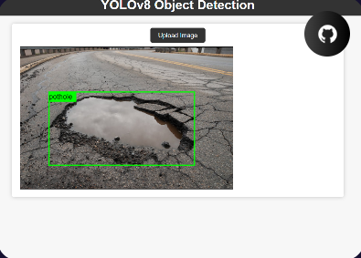

# Pothole Detection using YOLOv8 Deep Learning Model

This is a web interface for [YOLOv8 object detection neural network](https://ultralytics.com/yolov8) implemented in [Python](https://www.python.org). The model is designed to detect potholes in images.

## Preview



## Install

* Clone this repository: `git clone https://github.com/Vikas-ABD/Pothole_detection_with_web_app.git`
* Navigate to the root of the cloned repository.
* Install dependencies by running `pip install -r requirements.txt`

## Run

Execute:

```bash
python3 app.py


It will start a webserver on http://127.0.0.1:5000. Use any web browser to open the web interface.

Using the interface you can upload the image to the object detector and see bounding boxes of all objects detected on it.
